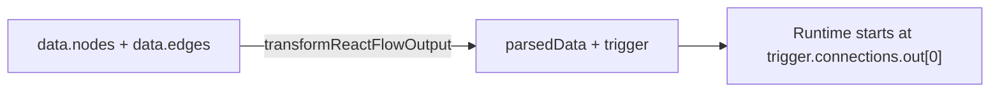

The board saves **two graphs**. IDs must match across `data.nodes`, `parsedData`, `trigger`, and every edge `source` / `target`.



## Canvas `data` (React Flow `toObject()`)

Root nodes:

```json
{
  "id": "wa_menu",
  "type": "whatsapp",
  "category": "Action",
  "position": { "x": 320, "y": 80 },
  "draggable": true,
  "selected": false,
  "data": {}
}
```

Sub-nodes are **siblings** in `data.nodes`, not nested. They carry `parentId`:

```json
{
  "id": "ans_tours",
  "type": "answer",
  "parentId": "wa_menu",
  "position": { "x": 0, "y": 0 },
  "data": { "label": "Tours", "index": 0, "editable": true, "removable": true }
}
```

Edges:

| Field | Value |
| --- | --- |
| `type` | `"buttonedge"` |
| `targetHandle` | `"in"` |
| Root **output** `sourceHandle` | `"out"` |
| Root **input** handle | `"in"` |
| Sub-node **output** `sourceHandle` | `"in"` — NestedSubNode quirk. Downstream edges from a button / true / false / case use `sourceHandle: "in"`. |

```json
[
  {
    "source": "trig_1",
    "target": "wa_menu",
    "sourceHandle": "out",
    "targetHandle": "in",
    "type": "buttonedge"
  },
  {
    "source": "ans_tours",
    "target": "ptr_tours",
    "sourceHandle": "in",
    "targetHandle": "in",
    "type": "buttonedge"
  }
]
```

When a node has sub-nodes, do **not** draw a root `out` edge from that parent. Execution continues from the sub-node `connections.out`.

## Execution `parsedData` + `trigger`

`transformReactFlowOutput` builds this from the canvas:

- The trigger is **removed** from `parsedData` and stored as `workflow.trigger`.
- `triggerType` is `trigger.data.eventType`.
- `parsedData` is **parent nodes only**. Sub-nodes hang off `parent.subNodes[]`.
- Each node has `connections: { out: string[] }` — target ids only. No handle ids. Branching is “which sub-node’s `connections.out`”.
- Runtime starts at `trigger.connections.out[0]`.

```json
{
  "triggerType": "Messages Created",
  "trigger": {
    "id": "trig_1",
    "type": "pingmeeTrigger",
    "category": "Trigger",
    "title": "pingmeeTrigger",
    "data": { "eventType": "Messages Created", "platform": "whatsapp" },
    "connections": { "out": ["wa_menu"] }
  },
  "parsedData": [
    {
      "id": "wa_menu",
      "type": "whatsapp",
      "category": "Action",
      "title": "whatsapp",
      "data": { "waitForUserResponse": true, "platform": "whatsapp" },
      "connections": {},
      "subNodes": [
        {
          "id": "ans_tours",
          "type": "answer",
          "parentId": "wa_menu",
          "title": "Tours",
          "data": { "label": "Tours", "index": 0 },
          "connections": { "out": ["ptr_tours"] }
        }
      ]
    }
  ]
}
```

<Note>
Parent `title` is usually the `NodeType` string. Sub-node `title` is the canvas `data.label`. If/Else matches `title.toLowerCase() === "true"` / `"false"`.
</Note>

## Mapping checklist

| Canvas | Execution |
| --- | --- |
| Trigger node in `data.nodes` | `workflow.trigger` only |
| Parent in `data.nodes` | Item in `parsedData` |
| Child with `parentId` | `parent.subNodes[]` |
| Edge `source → target` | `source.connections.out` includes `target` |
| Handle ids on edges | Dropped — only target ids remain |

## How to wire a graph

Build the canvas first, then **copy** each edge into execution `connections.out`. IDs must be identical in `data.nodes`, `data.edges[].source` / `target`, `parsedData`, `trigger`, and every `connections.out` entry.

### 1. Give every node a stable id

Use short unique strings (`trig_1`, `wa_menu`, `ans_tours`). Reuse the **same** string everywhere. Sub-nodes live in `data.nodes` as siblings with `parentId` set to the parent’s id.

### 2. Draw canvas edges (`data.edges`)

Every edge:

| Field | Value |
| --- | --- |
| `type` | `"buttonedge"` |
| `targetHandle` | `"in"` always |
| `sourceHandle` | `"out"` from a **root** node (trigger, HTTP, wait, pointer, message **without** sub-nodes) |
| `sourceHandle` | `"in"` from a **sub-node** (answer, `true` / `false`, switch case, fallback, timeout) |
| `source` / `target` | Node ids that exist in `data.nodes` |
| `id` | Optional unique string (board / analytics). Safe to send `e_<source>_<target>`. |

```json
[
  {
    "id": "e_trig_1_wa_menu",
    "source": "trig_1",
    "target": "wa_menu",
    "sourceHandle": "out",
    "targetHandle": "in",
    "type": "buttonedge"
  },
  {
    "id": "e_ans_tours_ptr_tours",
    "source": "ans_tours",
    "target": "ptr_tours",
    "sourceHandle": "in",
    "targetHandle": "in",
    "type": "buttonedge"
  }
]
```

Do **not** also draw a root `"out"` edge from a parent that has sub-nodes. The engine ignores parent `connections.out` once `subNodes` exist and continues from the **chosen** child’s `connections.out`.

### 3. Copy each edge into execution

For every canvas edge `source → target`, find that source in `trigger`, `parsedData[]`, or `parent.subNodes[]` and append `target` to `connections.out` (array of target **ids** only — no handles).

| Canvas | Execution |
| --- | --- |
| Trigger `out` → first action | `workflow.trigger.connections.out: ["wa_menu"]` |
| Root HTTP `out` → next | That HTTP node’s `connections.out: ["upd_conv"]` |
| Answer / true / case `in` → next | That **sub-node’s** `connections.out` (parent’s `connections` stays `{}`) |

Runtime starts at `trigger.connections.out[0]`. If that array is missing, the run never starts.

### 4. Sanity check

- Every `source` / `target` / `connections.out` id exists.
- Trigger is **not** in `parsedData`.
- Sub-nodes are **not** extra `parsedData` items; they hang off `parent.subNodes[]`.
- Parent with answers / true-false / cases has **no** root `out` edge.

Paired snippets: [Examples](/build-workflows/examples).
