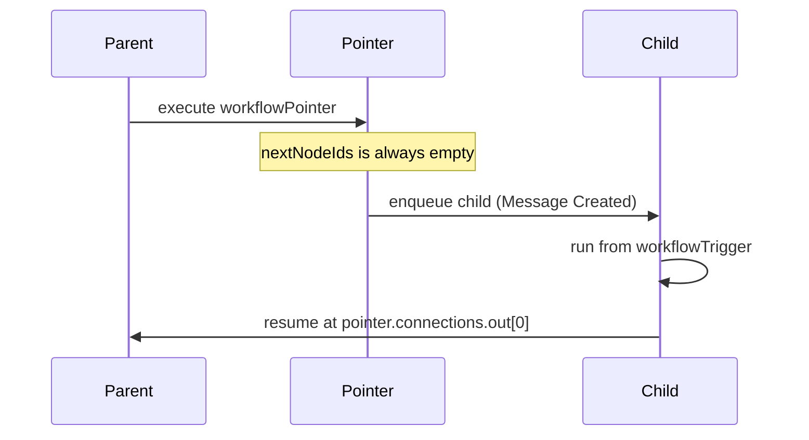

A pointer **hands off** to another workflow. It does not walk `connections.out` in the same execution.

## Rules

1. The child document **must** start with a `workflowTrigger` (in `data.nodes` and `workflow.trigger`).
2. The child **must** be `isActive: true`. If it is missing or inactive, the pointer **no-ops**: the parent does not continue along `connections.out`, and no child run is enqueued.
3. After the child finishes, the parent resumes at `pointer.connections.out[0]` (`continueFromNodeId`). If that array is empty, the parent stops after the child.

Activate the child **before** you trigger the parent.

## Pointer node

```json
{
  "id": "ptr_support",
  "type": "workflowPointer",
  "category": "Operation",
  "title": "workflowPointer",
  "data": {
    "workflowId": "wf_child_support",
    "workflowName": "Child support",
    "workflowFolderId": "folder_main",
    "isActive": true
  },
  "connections": { "out": ["upd_conv"] },
  "subNodes": []
}
```

Look up `workflowId` / `folderId` from [list workflows (minimal)](/api-reference/workflows/get-minimal). Use placeholders like `"wf_child_support"` only in docs — production payloads need real ids from that list or from create.

## Child trigger

```json
{
  "id": "trig_child",
  "type": "workflowTrigger",
  "category": "Trigger",
  "title": "workflowTrigger",
  "data": { "isActive": true, "variables": {} },
  "connections": { "out": ["wa_hello"] }
}
```

`triggerType` on children is often empty. Runtime still starts at `trigger.connections.out[0]`.

A pointer does **not** copy `triggerData` into the child. To pass a payload into a `workflowTrigger` graph, [POST `/trigger`](/api-reference/workflows/trigger) on **that** workflow — see [`triggerData`](/build-workflows/variables#triggerdata).

## Resume sequence



Create and activate the child with the same [save checklist](/build-workflows/overview) as any other workflow.

## Shared timeout and fallback

`workflow.settings` can route silence / unknown replies to another workflow (seen on real inbound bots):

```json
{
  "settings": {
    "sharedTimeout": {
      "enabled": true,
      "workflowId": "wf_child_support",
      "timerInfo": {
        "hours": "3",
        "minutes": "0",
        "seconds": "0",
        "numberOfSeconds": 10800
      }
    },
    "sharedFallback": {
      "enabled": true,
      "workflowId": "wf_child_support",
      "fallbackData": {
        "shouldSendReplyMessage": true,
        "unknownAnswerReplyMessage": "Please choose one of the options."
      }
    }
  }
}
```

A node-level `awaitResponseTimeout` / `noSelectionFallback` that is fully configured wins over the shared setting. Shared timeout/fallback also require the target workflow to be active and start with `workflowTrigger`.
